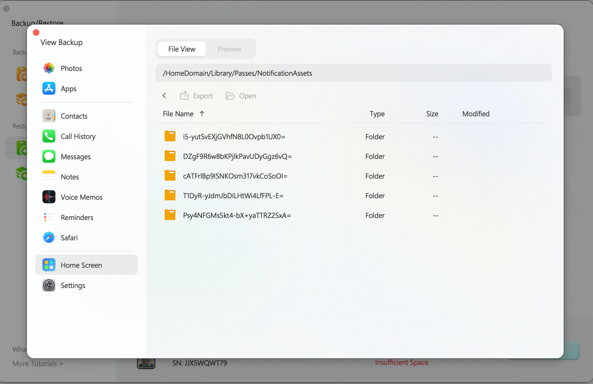

# iOS Script / Tool

> **⚠️ IMPORTANT NOTE:**
> This modification is **non-persistent**. The changes will revert (become invalid) if you reboot your device.

## Prerequisites

Before running the script, please ensure all the following requirements are met:

1.  **Device Configuration:**
    * Turn **OFF** "Find My iPhone".
    * Enable **Developer Mode** (`Settings` -> `Privacy & Security` -> `Developer Mode`).
2.  **Books App Setup:**
    * Download the **Apple Books** app from the App Store.
    * Open the app and successfully **download one book**.
    * *Tip: If you cannot download a book, try logging into the App Store with an Apple ID from a different region.*
3.  **System Requirements:**
    * A computer running **macOS** or **Ubuntu**.
    * **Python** environment installed.
4.  **Connectivity:**
    * Ensure both the iPhone and the Computer are connected to the **same Wi-Fi network**.
    * Connect the iPhone to the computer via **USB cable**.
    * *(Optional: Verify the connection status using tools like 3uTools or Finder).*

## Retrieving Wallet/Card IDs

If you need to obtain specific Wallet IDs, follow these steps:

1.  **Back up your iPhone** using **3uTools**.
2.  Open the backup file using the **3uTools Backup Viewer**.
3.  **Find Card IDs:**
    Navigate to the directory:
    `/HomeDomain/Library/Passes/Cards`
    Here you will find the IDs for your added cards.
4.  **Identify Card Issuer:**
    To confirm which card belongs to which issuer (by viewing the issuer's icon/logo), navigate to:
    `/HomeDomain/Library/Passes/Cards/NotificationAssets`



## Installation

Open your terminal and install the required Python dependencies using one of the following commands:

```bash
sudo pip install click requests packaging pymobiledevice3
Or, if you use pip3:

Bash

sudo pip3 install click requests packaging pymobiledevice3
Usage
Run the main script using administrator privileges (sudo). Replace the path below with the actual location of your script:

Bash

sudo python3 path/to/your/script/main.py
Troubleshooting
General Errors: If you encounter issues, delete the uuid.txt file generated in the script's folder. Then, restart your iPhone and try the process again.

UUID Fetching Failed: The most common issue involves fetching the device UUID. This is usually resolved by ensuring the Books app is set up correctly (see Prerequisites step 2). Using a foreign region Apple ID to download a book often fixes this.